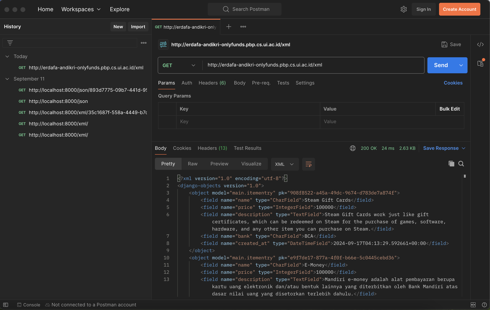
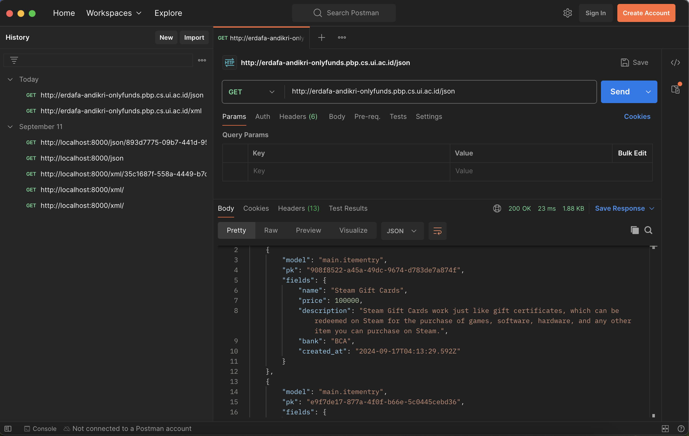
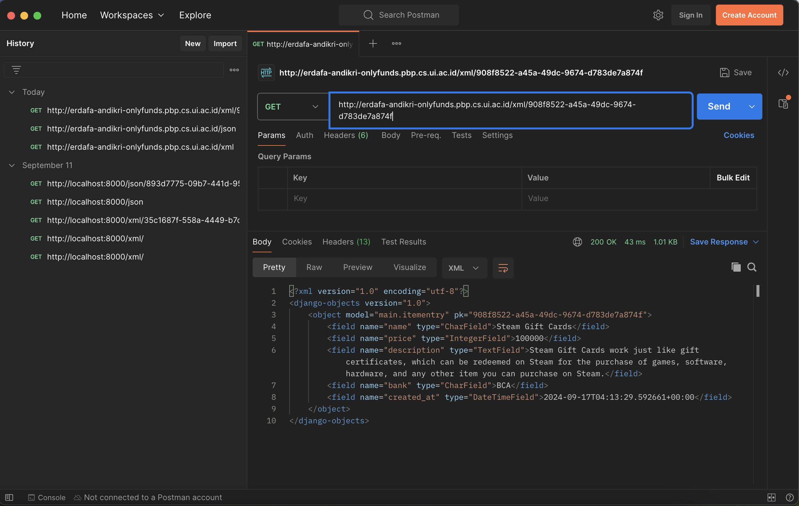
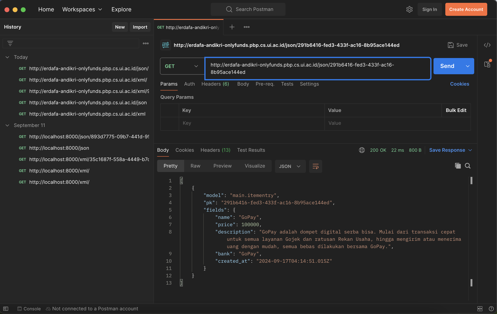

# OnlyFunds
**Home of The Best Cashless Transaction**

Welcome to OnlyFunds, the best platform for cashless transactions.

[OnlyFunds' Website](https://erdafa-andikri-onlyfunds.pbp.cs.ui.ac.id/)

## Contents:
- [Tugas 2](#tugas-2)
- [Tugas 3](#tugas-3)

## Tugas 3 <a id="tugas-3"></a>

### 1. Jelaskan mengapa kita memerlukan data delivery dalam pengimplementasian sebuah platform?

Data delivery diperlukan dalam pengimplementasian sebuah platform untuk memastikan bahwa data dapat dikirim dan diterima antara berbagai komponen sistem, seperti antara server dan klien. Ini memungkinkan aplikasi untuk berfungsi dengan baik, menyediakan informasi yang dibutuhkan pengguna, dan memastikan integritas dan konsistensi data.

### 2. Menurutmu, mana yang lebih baik antara XML dan JSON? Mengapa JSON lebih populer dibandingkan XML?

- **JSON**:
  - **Lebih Ringkas**: JSON memiliki sintaks yang lebih sederhana dan lebih ringkas dibandingkan XML, sehingga lebih mudah dibaca dan ditulis oleh manusia.
  - **Kinerja Lebih Baik**: JSON biasanya lebih cepat diproses oleh mesin karena ukurannya yang lebih kecil dan struktur yang lebih sederhana.
  - **Dukungan Luas**: JSON didukung secara native oleh banyak bahasa pemrograman dan API modern.

- **XML**:
  - **Lebih Fleksibel**: XML dapat digunakan untuk mendefinisikan format data yang lebih kompleks dan mendukung skema yang lebih ketat.
  - **Dukungan untuk Metadata**: XML memungkinkan penambahan metadata melalui atribut dan namespace.

**JSON lebih baik dibandingkan XML** karena lebih mudah digunakan dan lebih efisien dalam hal kinerja dan ukuran data, terutama dalam aplikasi web dan API modern.

### 3. Jelaskan fungsi dari method is_valid() pada form Django dan mengapa kita membutuhkan method tersebut?

Method `is_valid()` pada form Django digunakan untuk memeriksa apakah data yang dikirimkan ke form memenuhi semua validasi yang ditentukan dalam form tersebut. Method ini mengembalikan `True` jika data valid dan `False` jika tidak. 

Kita membutuhkan method ini untuk memastikan bahwa data yang diterima oleh aplikasi adalah valid sebelum diproses lebih lanjut, sehingga mencegah kesalahan dan potensi masalah keamanan.

### 4. Mengapa kita membutuhkan csrf_token saat membuat form di Django? Apa yang dapat terjadi jika kita tidak menambahkan csrf_token pada form Django? Bagaimana hal tersebut dapat dimanfaatkan oleh penyerang?

`csrf_token` digunakan untuk melindungi aplikasi dari serangan Cross-Site Request Forgery (CSRF). Ini adalah token unik yang dihasilkan untuk setiap sesi pengguna dan harus disertakan dalam setiap pengiriman formulir.

Jika kita tidak menambahkan `csrf_token`, aplikasi menjadi rentan terhadap serangan CSRF, di mana seorang penyerang dapat membuat pengguna yang sah secara tidak sadar mengirimkan permintaan yang tidak diinginkan ke server.

Kerentanan ini dapat dieksploitasi oleh penyerang untuk melakukan tindakan jahat atas nama pengguna yang sah, seperti memodifikasi data atau melakukan transaksi tanpa pengetahuan pengguna.

### 5. Jelaskan bagaimana cara kamu mengimplementasikan checklist di atas secara step-by-step (bukan hanya sekadar mengikuti tutorial).

1. Membuat Input Form untuk Menambahkan Objek Model
   - Langkah-langkah:
     1. Buat directory `templates` berisi `base.html`.
      ```
      
      <!DOCTYPE html>
      <html lang="en">
      <head>
         <meta charset="UTF-8" />
         <meta name="viewport" content="width=device-width, initial-scale=1.0" />
          
      </head>

      <body>
          
      </body>
      </html>
      ```
     2. Buat `forms.py` di directory proyek
      ```
      from django.forms import ModelForm
      from main.models import ItemEntry

      class ItemEntryForm(ModelForm):
         class Meta:
            model = ItemEntry
            fields = ["name", "description", "price", "bank"]
      ```
     3. Buat view untuk input form di `views.py`.
      ```
      from django.shortcuts import render, redirect
      from main.forms import ItemEntryForm

      def create_item_entry(request):
         form = ItemEntryForm(request.POST or None)

         if form.is_valid() and request.method == "POST":
            form.save()
            return redirect('main:show_main')

         context = {'form': form}
         return render(request, "create_item_entry.html", context)
      ```
     4. Buat template HTML di directory `templates` di directory aplikasi
      ```
       
      
      <h1>Add New Item Entry</h1>

      <form method="POST">
         
         <table>
            {{ form.as_table }}
            <tr>
                  <td></td>
                  <td>
                     <input type="submit" value="Add Item Entry" />
                  </td>
            </tr>
         </table>
      </form>

      
      ```
     4. Tambahkan URL untuk form di `urls.py` di directory aplikasi
      ```
      from django.urls import path
      from main.views import show_main, create_item_entry, show_xml, show_json, show_xml_by_id, show_json_by_id

      app_name = 'main'

      urlpatterns = [
         path('', show_main, name='show_main'),
         path('create-item-entry', create_item_entry, name='create_item_entry'),
      ]
      ```

2. Buat 4 Fungsi View untuk Menampilkan Objek dalam Format XML dan JSON
   - Langkah-langkah:
     1. Buat View untuk Format JSON dan XML
      - View XML:
      ```
      def show_xml(request):
         data = ItemEntry.objects.all()
         return HttpResponse(serializers.serialize("xml", data), content_type="application/xml")
      ```
      - View JSON:
      ```
      def show_json(request):
         data = ItemEntry.objects.all()
         return HttpResponse(serializers.serialize("json", data), content_type="application/json")
      ```
      - View XML by ID:
      ```
      def show_xml_by_id(request, id):
         data = ItemEntry.objects.filter(pk=id)
         return HttpResponse(serializers.serialize("xml", data), content_type="application/xml")
      ```
      - View JSON by ID:
      ```
      def show_json_by_id(request, id):
         data = ItemEntry.objects.filter(pk=id)
         return HttpResponse(serializers.serialize("json", data), content_type="application/json")
      ```
     2. Tambahkan routing URL untuk setiap view dalam format JSON dan XML ke file `urls.py` di directory aplikasi.
      ```
      from django.urls import path
      from main.views import show_main, create_item_entry, show_xml, show_json, show_xml_by_id, show_json_by_id

      app_name = 'main'

      urlpatterns = [
         path('', show_main, name='show_main'),
         path('create-item-entry', create_item_entry, name='create_item_entry'),
         path('xml/', show_xml, name='show_xml'),
         path('json/', show_json, name='show_json'),
         path('xml/<str:id>/', show_xml_by_id, name='show_xml_by_id'),
         path('json/<str:id>/', show_json_by_id, name='show_json_by_id'),
      ]
      ```


### 6. Mengakses keempat URL di poin 2 menggunakan Postman, membuat screenshot dari hasil akses URL pada Postman, dan menambahkannya ke dalam README.md.

### Hasil Akses URL di Postman

#### XML


#### JSON


#### XML by ID


#### JSON by ID


## Tugas 2 <a id="tugas-2"></a>

### 1. Jelaskan bagaimana cara kamu mengimplementasikan checklist di atas secara step-by-step (bukan hanya sekadar mengikuti tutorial).

1. **Setup Environment:**
   - Install Python dan Django.
   - Buat virtual environment dan aktifkan.
   - Install requirements/dependencies yang diperlukan.

2. **Create Django Project:**
   - Buat proyek Django baru menggunakan `django-admin startproject`.
   - Buat aplikasi baru menggunakan `python manage.py startapp`.

3. **Define Models:**
   - Buat model di `models.py` sesuai dengan kebutuhan aplikasi.
     ```
        from django.db import models

        class Item(models.Model):
           name = models.CharField(max_length=255)
           price = models.IntegerField()
           description = models.TextField()
           bank = models.CharField(max_length=255)
            created_at = models.DateTimeField(auto_now_add=True)

        def __str__(self):
           return self.name
     ```
   - Jalankan migrasi untuk membuat tabel di database. Gunakan `python manage.py makemigrations` dan `python manage.py migrate`

4. **Create Views and Templates:**
   - Buat fungsi view di `views.py`.
   - Buat template HTML di direktori `templates`.
     ```
        <h1>OnlyFunds</h1>
        <h5>NPM: </h5>
        <p>{{ npm }}<p>
        <h5>Name: </h5>
        <p>{{ name }}<p>
        <h5>Class: </h5>
        <p>{{ class }}<p>
     ```

5. **Configure URLs:**
   - Tambahkan URL routing di `urls.py` untuk menghubungkan view dengan URL.
     ```
     from django.urls import path
     from main.views import show_main

     app_name = 'main'

     urlpatterns = [
        path('', show_main, name='show_main'),
     ]
     ```

6. **Testing and Deployment:**
   - Jalankan server lokal untuk pengujian. Gunakan `python manage.py runserver`
   - Deploy aplikasi ke platform hosting seperti Vercel (atau Pacil Web Service 😌).

### 2. Buatlah bagan yang berisi request client ke web aplikasi berbasis Django beserta responnya dan jelaskan pada bagan tersebut kaitan antara `urls.py`, `views.py`, `models.py`, dan berkas HTML.


**Penjelasan:**
- **Client Request:** Client mengirimkan request ke server.
- **urls.py:** URL routing menangkap request dan mengarahkan ke view yang sesuai.
- **views.py:** View memproses request, berinteraksi dengan model jika diperlukan, dan mengembalikan response.
- **models.py:** Model berinteraksi dengan database untuk mengambil atau menyimpan data.
- **HTML Template:** View merender template HTML dengan data yang diperoleh dari model dan mengembalikan response ke client.

### 3. Jelaskan fungsi git dalam pengembangan perangkat lunak!

Git adalah sistem kontrol versi yang digunakan untuk melacak perubahan dalam kode sumber selama pengembangan perangkat lunak. Fungsi utamanya meliputi:
- **Version Control:** Melacak perubahan kode dan memungkinkan pengembang untuk kembali ke versi sebelumnya.
- **Collaboration:** Memungkinkan banyak pengembang untuk bekerja pada proyek yang sama secara bersamaan.
- **Branching and Merging:** Memungkinkan pengembang untuk bekerja pada fitur atau perbaikan bug secara terpisah dan menggabungkannya kembali ke cabang utama.

### 4. Menurut Anda, dari semua framework yang ada, mengapa framework Django dijadikan permulaan pembelajaran pengembangan perangkat lunak?

Django dijadikan permulaan pembelajaran pengembangan perangkat lunak karena:
- **Features:** Django menyediakan banyak fitur bawaan yang memudahkan pengembangan aplikasi web.
- **Scalability:** Django dirancang untuk menangani aplikasi yang kompleks dan dapat diskalakan.
- **Community and Documentation:** Django memiliki komunitas yang besar dan dokumentasi yang sangat baik, sehingga memudahkan pembelajaran.
- **Security:** Django memiliki fitur keamanan bawaan yang membantu melindungi aplikasi dari ancaman umum.

### 5. Mengapa model pada Django disebut sebagai ORM?

Model pada Django disebut sebagai ORM (Object-Relational Mapping) karena:
- **Abstraction:** ORM menyediakan lapisan abstraksi antara kode Python dan database relasional.
- **Object-Oriented:** ORM memungkinkan pengembang untuk bekerja dengan database menggunakan objek Python, bukan query SQL.
- **Automatic Mapping:** ORM secara otomatis memetakan tabel database ke kelas Python dan kolom tabel ke atribut kelas.