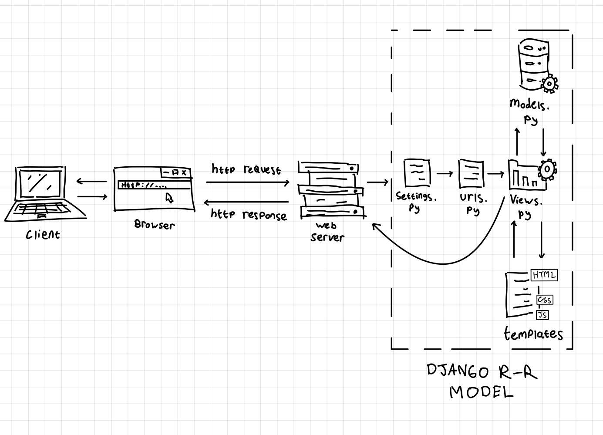

# OnlyFunds

[OnlyFunds' Website](https://erdafa-andikri-onlyfunds.pbp.cs.ui.ac.id/)

### 1. Jelaskan bagaimana cara kamu mengimplementasikan checklist di atas secara step-by-step (bukan hanya sekadar mengikuti tutorial).

1. **Setup Environment:**
   - Install Python dan Django.
   - Buat virtual environment dan aktifkan.
   - Install requirements/dependencies yang diperlukan.

2. **Create Django Project:**
   - Buat proyek Django baru menggunakan `django-admin startproject`.
   - Buat aplikasi baru menggunakan `python manage.py startapp`.

3. **Define Models:**
   - Buat model di `models.py` sesuai dengan kebutuhan aplikasi.
     ```
        from django.db import models

        class Item(models.Model):
           name = models.CharField(max_length=255)
           price = models.IntegerField()
           description = models.TextField()
           bank = models.CharField(max_length=255)
            created_at = models.DateTimeField(auto_now_add=True)

        def __str__(self):
           return self.name
     ```
   - Jalankan migrasi untuk membuat tabel di database. Gunakan `python manage.py makemigrations` dan `python manage.py migrate`

4. **Create Views and Templates:**
   - Buat fungsi view di `views.py`.
   - Buat template HTML di direktori `templates`.
     ```
        <h1>OnlyFunds</h1>
        <h5>NPM: </h5>
        <p>{{ npm }}<p>
        <h5>Name: </h5>
        <p>{{ name }}<p>
        <h5>Class: </h5>
        <p>{{ class }}<p>
     ```

5. **Configure URLs:**
   - Tambahkan URL routing di `urls.py` untuk menghubungkan view dengan URL.
     ```
     from django.urls import path
     from main.views import show_main

     app_name = 'main'

     urlpatterns = [
        path('', show_main, name='show_main'),
     ]
     ```

6. **Testing and Deployment:**
   - Jalankan server lokal untuk pengujian. Gunakan `python manage.py runserver`
   - Deploy aplikasi ke platform hosting seperti Vercel (atau Pacil Web Service 😌).

### 2. Buatlah bagan yang berisi request client ke web aplikasi berbasis Django beserta responnya dan jelaskan pada bagan tersebut kaitan antara `urls.py`, `views.py`, `models.py`, dan berkas HTML.



**Penjelasan:**
- **Client Request:** Client mengirimkan request ke server.
- **urls.py:** URL routing menangkap request dan mengarahkan ke view yang sesuai.
- **views.py:** View memproses request, berinteraksi dengan model jika diperlukan, dan mengembalikan response.
- **models.py:** Model berinteraksi dengan database untuk mengambil atau menyimpan data.
- **HTML Template:** View merender template HTML dengan data yang diperoleh dari model dan mengembalikan response ke client.

### 3. Jelaskan fungsi git dalam pengembangan perangkat lunak!

Git adalah sistem kontrol versi yang digunakan untuk melacak perubahan dalam kode sumber selama pengembangan perangkat lunak. Fungsi utamanya meliputi:
- **Version Control:** Melacak perubahan kode dan memungkinkan pengembang untuk kembali ke versi sebelumnya.
- **Collaboration:** Memungkinkan banyak pengembang untuk bekerja pada proyek yang sama secara bersamaan.
- **Branching and Merging:** Memungkinkan pengembang untuk bekerja pada fitur atau perbaikan bug secara terpisah dan menggabungkannya kembali ke cabang utama.

### 4. Menurut Anda, dari semua framework yang ada, mengapa framework Django dijadikan permulaan pembelajaran pengembangan perangkat lunak?

Django dijadikan permulaan pembelajaran pengembangan perangkat lunak karena:
- **Features:** Django menyediakan banyak fitur bawaan yang memudahkan pengembangan aplikasi web.
- **Scalability:** Django dirancang untuk menangani aplikasi yang kompleks dan dapat diskalakan.
- **Community and Documentation:** Django memiliki komunitas yang besar dan dokumentasi yang sangat baik, sehingga memudahkan pembelajaran.
- **Security:** Django memiliki fitur keamanan bawaan yang membantu melindungi aplikasi dari ancaman umum.

### 5. Mengapa model pada Django disebut sebagai ORM?

Model pada Django disebut sebagai ORM (Object-Relational Mapping) karena:
- **Abstraction:** ORM menyediakan lapisan abstraksi antara kode Python dan database relasional.
- **Object-Oriented:** ORM memungkinkan pengembang untuk bekerja dengan database menggunakan objek Python, bukan query SQL.
- **Automatic Mapping:** ORM secara otomatis memetakan tabel database ke kelas Python dan kolom tabel ke atribut kelas.
