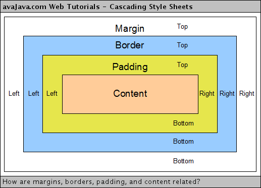

# OnlyFunds
**Home of The Best Cashless Transaction**

Welcome to OnlyFunds, the best platform for cashless transactions.

[OnlyFunds' Website](https://erdafa-andikri-onlyfunds.pbp.cs.ui.ac.id/)

## Contents:
- [Tugas 2](#tugas-2)
- [Tugas 3](#tugas-3)
- [Tugas 4](#tugas-4)
- [Tugas 5](#tugas-5)
- [Tugas 6](#tugas-6)

## Tugas 6 <a id="tugas-6"></a>

### 1. Jelaskan manfaat dari penggunaan JavaScript dalam pengembangan aplikasi web!

JavaScript adalah bahasa pemrograman yang sangat penting dalam pengembangan aplikasi web. Berikut adalah beberapa manfaat utama dari penggunaan JavaScript:

1. **Interaktivitas**: JavaScript memungkinkan pengembang untuk membuat halaman web yang interaktif dan responsif. Dengan JavaScript, elemen-elemen pada halaman web dapat berinteraksi dengan pengguna tanpa perlu memuat ulang halaman.
2. **Pengolahan Data di Client-Side**: JavaScript memungkinkan pengolahan data di sisi klien, yang dapat mengurangi beban server dan meningkatkan kecepatan respon aplikasi.
3. **Integrasi dengan HTML dan CSS**: JavaScript dapat dengan mudah diintegrasikan dengan HTML dan CSS untuk membuat antarmuka pengguna yang dinamis dan menarik.
4. **Ekosistem yang Luas**: JavaScript memiliki ekosistem yang luas dengan banyak pustaka dan framework seperti React, Angular, dan Vue.js yang memudahkan pengembangan aplikasi web yang kompleks.

## 2. Jelaskan fungsi dari penggunaan `await` ketika kita menggunakan `fetch()`! Apa yang akan terjadi jika kita tidak menggunakan `await`?

`await` digunakan untuk menunggu hasil dari operasi asynchronous sebelum melanjutkan eksekusi kode berikutnya. Ketika kita menggunakan `fetch()` untuk melakukan permintaan HTTP, `await` memastikan bahwa kita menunggu respons dari server sebelum melanjutkan ke langkah berikutnya. Berikut adalah contoh penggunaannya:

```
async function fetchData() {
    const response = await fetch('https://api.example.com/data');
    const data = await response.json();
    console.log(data);
}
```

Jika kita tidak menggunakan `await`, kode akan melanjutkan eksekusi tanpa menunggu hasil dari `fetch()`, yang dapat menyebabkan kesalahan karena data belum tersedia saat kita mencoba mengaksesnya.

### 3. Mengapa kita perlu menggunakan decorator `csrf_exempt` pada view yang akan digunakan untuk AJAX `POST`?

Decorator csrf_exempt digunakan untuk menonaktifkan perlindungan CSRF (Cross-Site Request Forgery) pada view tertentu. Ini diperlukan ketika kita menggunakan AJAX POST karena permintaan AJAX tidak selalu menyertakan token CSRF secara otomatis. Dengan menonaktifkan perlindungan CSRF pada view tersebut, kita dapat memastikan bahwa permintaan AJAX dapat diproses tanpa masalah.

Namun, penting untuk berhati-hati saat menggunakan csrf_exempt karena ini dapat membuka celah keamanan jika tidak digunakan dengan benar.

### 4. Pada tutorial PBP minggu ini, pembersihan data input pengguna dilakukan di belakang (backend) juga. Mengapa hal tersebut tidak dilakukan di frontend saja?

Pembersihan data input pengguna di backend dilakukan untuk memastikan keamanan dan integritas data. Berikut adalah beberapa alasan mengapa pembersihan data tidak hanya dilakukan di frontend:

1. **Keamanan**: Validasi dan pembersihan data di backend membantu mencegah serangan seperti SQL Injection dan XSS (Cross-Site Scripting).
2. **Konsistensi**: Backend dapat memastikan bahwa semua data yang masuk ke sistem telah divalidasi dan dibersihkan dengan cara yang konsisten.
3. **Keandalan**: Pengguna dapat memanipulasi kode JavaScript di frontend, sehingga validasi di frontend saja tidak dapat diandalkan sepenuhnya.

### 5. Jelaskan bagaimana cara kamu mengimplementasikan checklist di atas secara step-by-step (bukan hanya sekadar mengikuti tutorial)!

1. Tambahkan error message pada login di `main/views.py`
```
...
if form.is_valid():
    user = form.get_user()
    login(request, user)
    response = HttpResponseRedirect(reverse("main:show_main"))
    response.set_cookie('last_login', str(datetime.datetime.now()))
    return response
else:
    messages.error(request, "Invalid username or password. Please try again.")
...
```

2. Membuat function untuk menambahkan item dengan AJAX
```
...
@csrf_exempt
@require_POST
def add_mood_entry_ajax(request):
    mood = request.POST.get("mood")
    feelings = request.POST.get("feelings")
    mood_intensity = request.POST.get("mood_intensity")
    user = request.user

    new_mood = MoodEntry(
        mood=mood, feelings=feelings,
        mood_intensity=mood_intensity,
        user=user
    )
    new_mood.save()

    return HttpResponse(b"CREATED", status=201)
...
```

3. Menambahkan Routing Untuk Fungsi add_item_entry_ajax
```
from main.views import ..., add_item_entry_ajax
```

```
urlpatterns = [
    ...
    path('create-item-entry-ajax', add_item_entry_ajax, name='add_item_entry_ajax'),
]
```

4. Menampilkan Data Item Entry dengan fetch() API

5. Membuat Modal Sebagai Form untuk Menambahkan Item

6. Menambahkan Data Item dengan AJAX

7. Melindungi Aplikasi dari Cross Site Scripting (XSS)


## Tugas 5 <a id="tugas-4"></a>

### 1. Jika terdapat beberapa CSS selector untuk suatu elemen HTML, jelaskan urutan prioritas pengambilan CSS selector tersebut!

Jika terdapat beberapa CSS selector yang diterapkan pada elemen HTML yang sama, urutan prioritas pengambilan CSS selector ditentukan oleh spesifisitas selector tersebut. Berikut adalah urutan prioritas dari yang paling rendah hingga yang paling tinggi:

1. **Selector Universal (*)** - paling rendah prioritasnya.
2. **Selector Elemen/Tag** (misalnya, div, p).
3. **Selector Class** (misalnya, .className).
4. **Selector Atribut** (misalnya, [type="text"]).
5. **Selector Pseudo-Class** (misalnya, :hover, :nth-child()).
6. **Selector ID** (misalnya, #idName).
7. **Selector Inline Style** - CSS yang didefinisikan langsung pada atribut elemen HTML (style="...").
8. **!important** - menimpa semua aturan di atas jika digunakan.

### 2. Mengapa responsive design menjadi konsep yang penting dalam pengembangan aplikasi web? Berikan contoh aplikasi yang sudah dan belum menerapkan responsive design!

Responsive design merupakan konsep penting dalam pengembangan aplikasi web untuk memastikan aplikasi dapat beradaptasi dengan berbagai ukuran layar dan perangkat. Desain yang tidak responsif akan mengakibatkan pengalaman pengguna yang buruk, terutama bagi pengguna perangkat mobile.

Contoh aplikasi yang telah menerapkan responsive design:

**[Instagram](instagram.com)**: Menampilkan tata letak yang menyesuaikan dengan baik di berbagai ukuran layar, mulai dari smartphone hingga desktop.
Contoh aplikasi yang belum menerapkan responsive design:

**[SIAK NG](academic.ui.ac.id)**: Situs seperti ini tidak menyesuaikan ukuran tampilan berdasarkan perangkat dan sering terlihat rusak atau sulit dibaca di perangkat mobile.

### 3. Jelaskan perbedaan antara margin, border, dan padding, serta cara untuk mengimplementasikan ketiga hal tersebut!

1. **Margin**: Area di luar border, digunakan untuk memberikan ruang antara elemen dengan elemen lainnya.
2. **Border**: Garis yang mengelilingi elemen, dapat digunakan untuk mempertegas batas elemen.
3. **Padding**: Area di dalam border, memberikan ruang antara konten elemen dan border-nya.



### 4. Jelaskan konsep flex box dan grid layout beserta kegunaannya!

1. **Flexbox**: Digunakan untuk menyusun elemen dalam satu dimensi (baik baris atau kolom). Flexbox memudahkan pengaturan elemen dalam baris atau kolom yang fleksibel. Kegunaannya sangat baik untuk membuat layout yang responsif tanpa memerlukan float atau positioning.

```
.container {
   display: flex;
   justify-content: space-between;
}
```

2. **Flexbox**: Digunakan untuk menyusun elemen dalam satu dimensi (baik baris atau kolom). Flexbox memudahkan pengaturan elemen dalam baris atau kolom yang fleksibel. Kegunaannya sangat baik untuk membuat layout yang responsif tanpa memerlukan float atau positioning.

```
.container {
   display: grid;
   grid-template-columns: 1fr 1fr 1fr;
}
```

### 5. Jelaskan bagaimana cara kamu mengimplementasikan checklist di atas secara step-by-step (bukan hanya sekadar mengikuti tutorial)!

1. Menambahkan tailwind ke aplikasi, dengan update `base.html` di templates root
```
<head>

    <meta charset="UTF-8" />
    <meta name="viewport" content="width=device-width, initial-scale=1">

<script src="https://cdn.tailwindcss.com">
</script>
</head>
```

2. Tambahkan fitur edit_item dan delete_item
```
def edit_item(request, id):
    # Get item entry berdasarkan id
    mood = ItemEntry.objects.get(pk = id)

    # Set item entry sebagai instance dari form
    form = ItemEntryForm(request.POST or None, instance=mood)

    if form.is_valid() and request.method == "POST":
        # Simpan form dan kembali ke halaman awal
        form.save()
        return HttpResponseRedirect(reverse('main:show_main'))

    context = {'form': form}
    return render(request, "edit_item.html", context)
```

```
def delete_item(request, id):
    # Get item berdasarkan id
    item = ItemEntry.objects.get(pk = id)
    # Hapus mood
    item.delete()
    # Kembali ke halaman awal
    return HttpResponseRedirect(reverse('main:show_main'))
```

3. Tambahkan import di `views.py`
```
from django.shortcuts import .., reverse
from django.http import .., HttpResponseRedirect
```

```
from main.views import delete_mood
```

4. Buat berkas HTML, `edit_item.html` pada direktori `main/templates`
```






<h1>Edit Mood</h1>

<form method="POST">
    
    <table>
        {{ form.as_table }}
        <tr>
            <td></td>
            <td>
                <input type="submit" value="Edit Mood"/>
            </td>
        </tr>
    </table>
</form>


```

5. Buka `main.html` dan ubahlah kode
```
...
<tr>
    ...
    <td>
        <a href="">
            <button>
                Edit
            </button>
        </a>
    </td>
    <td>
        <a href="">
            <button>
                Delete
            </button>
        </a>
    </td>
</tr>
...
```

6. Tambahkan url di `urls.py`
```
...

path('edit-mood/<uuid:id>', edit_mood, name='edit_mood'),
path('delete/<uuid:id>', delete_mood, name='delete_mood'),
...
```

7. Tambahkan `navbar.html` pada directory templates di root
```
<nav class="bg-gradient-to-r from-blue-600 to-white shadow-lg fixed top-0 left-0 z-40 w-screen">
    <div class="max-w-7xl mx-auto px-4 sm:px-6 lg:px-8">
        <div class="flex items-center justify-between h-16">
            <div class="flex items-center">
                <h1 class="text-3xl font-extrabold text-center text-blue-100">OnlyFunds</h1>
            </div>
            <div class="hidden md:flex items-center">
                
                    <span class="text-gray-800 mr-4">Welcome, {{ user.username }}</span>
                    <a href="" class="text-center bg-red-600 hover:bg-red-700 text-white font-bold py-2 px-4 rounded-full transition duration-300">
                        Logout
                    </a>
                
                    <a href="" class="text-center bg-blue-600 hover:bg-blue-700 text-white font-bold py-2 px-4 rounded-full transition duration-300 mr-2">
                        Login
                    </a>
                    <a href="" class="text-center bg-green-600 hover:bg-green-700 text-white font-bold py-2 px-4 rounded-full transition duration-300">
                        Register
                    </a>
                
            </div>
            <div class="md:hidden flex items-center">
                <button class="mobile-menu-button">
                    <svg class="w-8 h-8 text-blue-900" fill="none" stroke-linecap="round" stroke-linejoin="round" stroke-width="2" viewBox="0 0 24 24" stroke="currentColor">
                        <path d="M4 6h16M4 12h16M4 18h16"></path>
                    </svg>
                </button>
            </div>
        </div>
    </div>
    <!-- Mobile menu -->
    <div class="mobile-menu hidden md:hidden px-4 w-full md:max-w-full">
        <div class="pt-2 pb-3 space-y-1 mx-auto">
            
                <span class="block text-gray-800 px-3 py-2">Welcome, {{ user.username }}</span>
                <a href="" class="block text-center bg-red-600 hover:bg-red-700 text-white font-bold py-2 px-4 rounded-full transition duration-300">
                    Logout
                </a>
            
                <a href="" class="block text-center bg-blue-600 hover:bg-blue-700 text-white font-bold py-2 px-4 rounded-full transition duration-300 mb-2">
                    Login
                </a>
                <a href="" class="block text-center bg-green-600 hover:bg-green-700 text-white font-bold py-2 px-4 rounded-full transition duration-300">
                    Register
                </a>
            
        </div>
    </div>
    <script>
        const btn = document.querySelector("button.mobile-menu-button");
        const menu = document.querySelector(".mobile-menu");

        btn.addEventListener("click", () => {
            menu.classList.toggle("hidden");
        });
    </script>
</nav>
```

8. Kemudian, tautkan navbar tersebut ke dalam `main.html`, `create_item_entry.html`, dan `edit_item.html` yang berada di subdirektori main/templates/ dengan menggunakan tags include:
```



...

```

9. Kemudian kita akan menambahkan style pada halaman yang kita buat dengan menggunakan Tailwind CSS.


## Tugas 4 <a id="tugas-4"></a>

### 1. Apa perbedaan antara `HttpResponseRedirect()` dan `redirect()`

- **HttpResponseRedirect()**: Adalah fumction dari django yang digunakan untuk membuat objek HttpResponse yang mengarahkan pengguna ke URL yang ditentukan.

   ```
   from django.http import HttpResponseRedirect
   return HttpResponseRedirect('/path/')
   ```

- **redirect()**: Adalah function shortcut oleh django. `redirect()` juga bisa menerima berbagai jenis argumen: URL dalam bentuk string, objek model, atau nama URL dari routing.

   ```
   from django.shortcuts import redirect
   return redirect('path')
   ```

Perbedaannya adalah `redirect()` lebih fleksibel dan mudah digunakan daripada `HttpResponseRedirect()`.

Tetapi secara internal `HttpResponseRedirect()` dan `redirect()` kurang lebih sama.

### 2.  Jelaskan cara kerja penghubungan model `Product` dengan `User`!

Penghubungan model Product dengan User pada Django biasanya dilakukan dengan menggunakan ForeignKey.

```
class ItemEntry(models.Model):
    id = models.UUIDField(primary_key=True, default=uuid.uuid4, editable=False)
    user = models.ForeignKey(User, on_delete=models.CASCADE)
    name = models.CharField(max_length=255)
    price = models.IntegerField()
    description = models.TextField()
    bank = models.CharField(max_length=255)
    created_at = models.DateTimeField(auto_now_add=True)
```

- **ForeignKey**: Digunakan untuk membuat hubungan antar model. Dalam hal ini, Product terhubung ke model User menggunakan ForeignKey.
- **on_delete=models.CASCADE**: Menentukan bahwa jika objek User dihapus, semua produk yang terhubung dengan pengguna tersebut juga akan dihapus.

Hubungan ini berguna untuk memastikan bahwa setiap produk dimiliki oleh pengguna yang terdaftar dan bisa digunakan untuk memfilter produk berdasarkan pengguna, atau menampilkan daftar produk yang terkait dengan pengguna tertentu.

### 3. Apa perbedaan antara authentication dan authorization, apakah yang dilakukan saat pengguna login? Jelaskan bagaimana Django mengimplementasikan kedua konsep tersebut.

- **Authentication**: Adalah proses memverifikasi identitas pengguna, biasanya dilakukan melalui username dan password. Tujuan dari authentication adalah memastikan bahwa pengguna yang mengakses sistem adalah pengguna yang sah.

- **Authorization**: Adalah proses menentukan apa yang dapat diakses oleh pengguna setelah mereka diautentikasi. Ini berkaitan dengan hak akses atau izin yang diberikan kepada pengguna untuk melakukan tindakan tertentu atau mengakses sumber daya tertentu di aplikasi.

Django mengimplementasikan kedua konsep ini melalui:

- **Authentication**: Django memiliki django.contrib.auth yang menyediakan model User dan berbagai method untuk melakukan login, logout, dan memverifikasi identitas pengguna.

- **Authorization**: Django menyediakan sistem izin (permissions) yang bisa ditetapkan pada level pengguna atau grup untuk mengontrol akses ke berbagai bagian dari aplikasi.

### 4. Bagaimana Django mengingat pengguna yang telah login? Jelaskan kegunaan lain dari cookies dan apakah semua cookies aman digunakan?

Ketika pengguna berhasil login, Django menyimpan session ID dalam sebuah cookie di browser pengguna. Cookie ini kemudian dikirim kembali ke server pada setiap permintaan berikutnya untuk mengidentifikasi pengguna yang telah login.

- **Kegunaan lain dari cookies**: Cookies digunakan untuk menyimpan data pengguna seperti preferensi, riwayat sesi, atau data pelacakan untuk analisis web. Mereka juga dapat digunakan untuk melacak item yang ditambahkan ke keranjang belanja di aplikasi e-commerce.

- **Keamanan cookies**: Tidak semua cookies aman. Untuk meningkatkan keamanan, cookies harus diberi tanda HttpOnly untuk mencegah akses melalui JavaScript dan Secure untuk memastikan bahwa cookies hanya dikirimkan melalui koneksi HTTPS. Selain itu, menggunakan CSRF token membantu mencegah serangan pemalsuan permintaan lintas situs.

### 5. Jelaskan bagaimana cara kamu mengimplementasikan checklist di atas secara step-by-step (bukan hanya sekadar mengikuti tutorial).

1. Buatlah `register.html` di direktori `main/templates`
   ```
   

   
   <title>Register</title>
   

   

   <div class="login">
   <h1>Register</h1>

   <form method="POST">
      
      <table>
         {{ form.as_table }}
         <tr>
         <td></td>
         <td><input type="submit" name="submit" value="Daftar" /></td>
         </tr>
      </table>
   </form>

   
   <ul>
      
      <li>{{ message }}</li>
      
   </ul>
   
   </div>

   
   ```

2. Tambahkan fungsi `register` di bawah ini ke dalam `views.py`
   ```
   def register(request):
      form = UserCreationForm()

      if request.method == "POST":
         form = UserCreationForm(request.POST)
         if form.is_valid():
               form.save()
               messages.success(request, 'Your account has been successfully created!')
               return redirect('main:login')
      context = {'form':form}
      return render(request, 'register.html', context)
   ```

3. Tambahkan path url ke dalam `urlpatterns`
   ```
   from main.views import register
   urlpatterns = [
      ...
      path('register/', register, name='register'),
   ]
   ```

4. Buatlah `login.html` pada direktori `main/templates`
   ```
   

   
   <title>Login</title>
   

   
   <div class="login">
   <h1>Login</h1>

   <form method="POST" action="">
      
      <table>
         {{ form.as_table }}
         <tr>
         <td></td>
         <td><input class="btn login_btn" type="submit" value="Login" /></td>
         </tr>
      </table>
   </form>

   
   <ul>
      
      <li>{{ message }}</li>
      
   </ul>
    Don't have an account yet?
   <a href="">Register Now</a>
   </div>

   
   ```

5. Tambahkan fungsi `login_user` di bawah ini ke dalam `views.py`
   ```
   def login_user(request):
      if request.method == 'POST':
         form = AuthenticationForm(data=request.POST)

         if form.is_valid():
               user = form.get_user()
               login(request, user)
               return redirect('main:show_main')

      else:
         form = AuthenticationForm(request)
      context = {'form': form}
      return render(request, 'login.html', context)
   ```

6. Tambahkan path url ke dalam `urlpatterns`
   ```
   from main.views import login_user
   urlpatterns = [
      ...
      path('login/', login_user, name='login'),
   ]
   ```

7. Tambahkan kode ini di `main.html` yang ada pada direktori `main/templates` setelah hyperlink tag untuk Add New Mood Entry.

   ```
   ...
   <a href="">
   <button>Logout</button>
   </a>
   ...
   ```

8. Tambahkan fungsi di bawah ini ke dalam fungsi `views.py`
   ```
   def logout_user(request):
      logout(request)
      return redirect('main:login')
   ```

9. Tambahkan path url ke dalam `urlpatterns`
   ```
   from main.views import logout_user
   urlpatterns = [
      ...
      path('logout/', logout_user, name='logout'),
   ]
   ```

10. Pada fungsi login_user, kita akan menambahkan fungsionalitas menambahkan cookie yang bernama last_login untuk melihat kapan terakhir kali pengguna melakukan login.
   ```
   ...
   if form.is_valid():
      user = form.get_user()
      login(request, user)
      response = HttpResponseRedirect(reverse("main:show_main"))
      response.set_cookie('last_login', str(datetime.datetime.now()))
      return response
   ...
   ```

11. Pada fungsi show_main, tambahkan potongan kode 'last_login': request.COOKIES['last_login'] ke dalam variabel context
   ```
   context = {
      'name': 'Pak Bepe',
      'class': 'PBP D',
      'npm': '2306123456',
      'mood_entries': mood_entries,
      'last_login': request.COOKIES['last_login'],
   }
   ```

12. Ubah fungsi `logout_user`
   ```
   def logout_user(request):
      logout(request)
      response = HttpResponseRedirect(reverse('main:login'))
      response.delete_cookie('last_login')
      return response
   ```

13. Buka berkas main.html dan tambahkan potongan kode berikut di setelah tombol logout untuk menampilkan data last login.
   ```
   ...
   <h5>Sesi terakhir login: {{ last_login }}</h5>
   ...
   ```


## Tugas 3 <a id="tugas-3"></a>

### 1. Jelaskan mengapa kita memerlukan data delivery dalam pengimplementasian sebuah platform?

Data delivery diperlukan dalam pengimplementasian sebuah platform untuk memastikan bahwa data dapat dikirim dan diterima antara berbagai komponen sistem, seperti antara server dan klien. Ini memungkinkan aplikasi untuk berfungsi dengan baik, menyediakan informasi yang dibutuhkan pengguna, dan memastikan integritas dan konsistensi data.

### 2. Menurutmu, mana yang lebih baik antara XML dan JSON? Mengapa JSON lebih populer dibandingkan XML?

- **JSON**:
  - **Lebih Ringkas**: JSON memiliki sintaks yang lebih sederhana dan lebih ringkas dibandingkan XML, sehingga lebih mudah dibaca dan ditulis oleh manusia.
  - **Kinerja Lebih Baik**: JSON biasanya lebih cepat diproses oleh mesin karena ukurannya yang lebih kecil dan struktur yang lebih sederhana.
  - **Dukungan Luas**: JSON didukung secara native oleh banyak bahasa pemrograman dan API modern.

- **XML**:
  - **Lebih Fleksibel**: XML dapat digunakan untuk mendefinisikan format data yang lebih kompleks dan mendukung skema yang lebih ketat.
  - **Dukungan untuk Metadata**: XML memungkinkan penambahan metadata melalui atribut dan namespace.

**JSON lebih baik dibandingkan XML** karena lebih mudah digunakan dan lebih efisien dalam hal kinerja dan ukuran data, terutama dalam aplikasi web dan API modern.

### 3. Jelaskan fungsi dari method is_valid() pada form Django dan mengapa kita membutuhkan method tersebut?

Method `is_valid()` pada form Django digunakan untuk memeriksa apakah data yang dikirimkan ke form memenuhi semua validasi yang ditentukan dalam form tersebut. Method ini mengembalikan `True` jika data valid dan `False` jika tidak. 

Kita membutuhkan method ini untuk memastikan bahwa data yang diterima oleh aplikasi adalah valid sebelum diproses lebih lanjut, sehingga mencegah kesalahan dan potensi masalah keamanan.

### 4. Mengapa kita membutuhkan csrf_token saat membuat form di Django? Apa yang dapat terjadi jika kita tidak menambahkan csrf_token pada form Django? Bagaimana hal tersebut dapat dimanfaatkan oleh penyerang?

`csrf_token` digunakan untuk melindungi aplikasi dari serangan Cross-Site Request Forgery (CSRF). Ini adalah token unik yang dihasilkan untuk setiap sesi pengguna dan harus disertakan dalam setiap pengiriman formulir.

Jika kita tidak menambahkan `csrf_token`, aplikasi menjadi rentan terhadap serangan CSRF, di mana seorang penyerang dapat membuat pengguna yang sah secara tidak sadar mengirimkan permintaan yang tidak diinginkan ke server.

Kerentanan ini dapat dieksploitasi oleh penyerang untuk melakukan tindakan jahat atas nama pengguna yang sah, seperti memodifikasi data atau melakukan transaksi tanpa pengetahuan pengguna.

### 5. Jelaskan bagaimana cara kamu mengimplementasikan checklist di atas secara step-by-step (bukan hanya sekadar mengikuti tutorial).

1. Membuat Input Form untuk Menambahkan Objek Model
   - Langkah-langkah:
     1. Buat directory `templates` berisi `base.html`.
      ```
      
      <!DOCTYPE html>
      <html lang="en">
      <head>
         <meta charset="UTF-8" />
         <meta name="viewport" content="width=device-width, initial-scale=1.0" />
          
      </head>

      <body>
          
      </body>
      </html>
      ```
     2. Buat `forms.py` di directory proyek
      ```
      from django.forms import ModelForm
      from main.models import ItemEntry

      class ItemEntryForm(ModelForm):
         class Meta:
            model = ItemEntry
            fields = ["name", "description", "price", "bank"]
      ```
     3. Buat view untuk input form di `views.py`.
      ```
      from django.shortcuts import render, redirect
      from main.forms import ItemEntryForm

      def create_item_entry(request):
         form = ItemEntryForm(request.POST or None)

         if form.is_valid() and request.method == "POST":
            form.save()
            return redirect('main:show_main')

         context = {'form': form}
         return render(request, "create_item_entry.html", context)
      ```
     4. Buat template HTML di directory `templates` di directory aplikasi
      ```
       
      
      <h1>Add New Item Entry</h1>

      <form method="POST">
         
         <table>
            {{ form.as_table }}
            <tr>
                  <td></td>
                  <td>
                     <input type="submit" value="Add Item Entry" />
                  </td>
            </tr>
         </table>
      </form>

      
      ```
     4. Tambahkan URL untuk form di `urls.py` di directory aplikasi
      ```
      from django.urls import path
      from main.views import show_main, create_item_entry, show_xml, show_json, show_xml_by_id, show_json_by_id

      app_name = 'main'

      urlpatterns = [
         path('', show_main, name='show_main'),
         path('create-item-entry', create_item_entry, name='create_item_entry'),
      ]
      ```

2. Buat 4 Fungsi View untuk Menampilkan Objek dalam Format XML dan JSON
   - Langkah-langkah:
     1. Buat View untuk Format JSON dan XML
      - View XML:
      ```
      def show_xml(request):
         data = ItemEntry.objects.all()
         return HttpResponse(serializers.serialize("xml", data), content_type="application/xml")
      ```
      - View JSON:
      ```
      def show_json(request):
         data = ItemEntry.objects.all()
         return HttpResponse(serializers.serialize("json", data), content_type="application/json")
      ```
      - View XML by ID:
      ```
      def show_xml_by_id(request, id):
         data = ItemEntry.objects.filter(pk=id)
         return HttpResponse(serializers.serialize("xml", data), content_type="application/xml")
      ```
      - View JSON by ID:
      ```
      def show_json_by_id(request, id):
         data = ItemEntry.objects.filter(pk=id)
         return HttpResponse(serializers.serialize("json", data), content_type="application/json")
      ```
     2. Tambahkan routing URL untuk setiap view dalam format JSON dan XML ke file `urls.py` di directory aplikasi.
      ```
      from django.urls import path
      from main.views import show_main, create_item_entry, show_xml, show_json, show_xml_by_id, show_json_by_id

      app_name = 'main'

      urlpatterns = [
         path('', show_main, name='show_main'),
         path('create-item-entry', create_item_entry, name='create_item_entry'),
         path('xml/', show_xml, name='show_xml'),
         path('json/', show_json, name='show_json'),
         path('xml/<str:id>/', show_xml_by_id, name='show_xml_by_id'),
         path('json/<str:id>/', show_json_by_id, name='show_json_by_id'),
      ]
      ```


### 6. Mengakses keempat URL di poin 2 menggunakan Postman, membuat screenshot dari hasil akses URL pada Postman, dan menambahkannya ke dalam README.md.

### Hasil Akses URL di Postman

#### XML


#### JSON


#### XML by ID


#### JSON by ID


## Tugas 2 <a id="tugas-2"></a>

### 1. Jelaskan bagaimana cara kamu mengimplementasikan checklist di atas secara step-by-step (bukan hanya sekadar mengikuti tutorial).

1. **Setup Environment:**
   - Install Python dan Django.
   - Buat virtual environment dan aktifkan.
   - Install requirements/dependencies yang diperlukan.

2. **Create Django Project:**
   - Buat proyek Django baru menggunakan `django-admin startproject`.
   - Buat aplikasi baru menggunakan `python manage.py startapp`.

3. **Define Models:**
   - Buat model di `models.py` sesuai dengan kebutuhan aplikasi.
     ```
        from django.db import models

        class Item(models.Model):
           name = models.CharField(max_length=255)
           price = models.IntegerField()
           description = models.TextField()
           bank = models.CharField(max_length=255)
            created_at = models.DateTimeField(auto_now_add=True)

        def __str__(self):
           return self.name
     ```
   - Jalankan migrasi untuk membuat tabel di database. Gunakan `python manage.py makemigrations` dan `python manage.py migrate`

4. **Create Views and Templates:**
   - Buat fungsi view di `views.py`.
   - Buat template HTML di direktori `templates`.
     ```
        <h1>OnlyFunds</h1>
        <h5>NPM: </h5>
        <p>{{ npm }}<p>
        <h5>Name: </h5>
        <p>{{ name }}<p>
        <h5>Class: </h5>
        <p>{{ class }}<p>
     ```

5. **Configure URLs:**
   - Tambahkan URL routing di `urls.py` untuk menghubungkan view dengan URL.
     ```
     from django.urls import path
     from main.views import show_main

     app_name = 'main'

     urlpatterns = [
        path('', show_main, name='show_main'),
     ]
     ```

6. **Testing and Deployment:**
   - Jalankan server lokal untuk pengujian. Gunakan `python manage.py runserver`
   - Deploy aplikasi ke platform hosting seperti Vercel (atau Pacil Web Service 😌).

### 2. Buatlah bagan yang berisi request client ke web aplikasi berbasis Django beserta responnya dan jelaskan pada bagan tersebut kaitan antara `urls.py`, `views.py`, `models.py`, dan berkas HTML.


**Penjelasan:**
- **Client Request:** Client mengirimkan request ke server.
- **urls.py:** URL routing menangkap request dan mengarahkan ke view yang sesuai.
- **views.py:** View memproses request, berinteraksi dengan model jika diperlukan, dan mengembalikan response.
- **models.py:** Model berinteraksi dengan database untuk mengambil atau menyimpan data.
- **HTML Template:** View merender template HTML dengan data yang diperoleh dari model dan mengembalikan response ke client.

### 3. Jelaskan fungsi git dalam pengembangan perangkat lunak!

Git adalah sistem kontrol versi yang digunakan untuk melacak perubahan dalam kode sumber selama pengembangan perangkat lunak. Fungsi utamanya meliputi:
- **Version Control:** Melacak perubahan kode dan memungkinkan pengembang untuk kembali ke versi sebelumnya.
- **Collaboration:** Memungkinkan banyak pengembang untuk bekerja pada proyek yang sama secara bersamaan.
- **Branching and Merging:** Memungkinkan pengembang untuk bekerja pada fitur atau perbaikan bug secara terpisah dan menggabungkannya kembali ke cabang utama.

### 4. Menurut Anda, dari semua framework yang ada, mengapa framework Django dijadikan permulaan pembelajaran pengembangan perangkat lunak?

Django dijadikan permulaan pembelajaran pengembangan perangkat lunak karena:
- **Features:** Django menyediakan banyak fitur bawaan yang memudahkan pengembangan aplikasi web.
- **Scalability:** Django dirancang untuk menangani aplikasi yang kompleks dan dapat diskalakan.
- **Community and Documentation:** Django memiliki komunitas yang besar dan dokumentasi yang sangat baik, sehingga memudahkan pembelajaran.
- **Security:** Django memiliki fitur keamanan bawaan yang membantu melindungi aplikasi dari ancaman umum.

### 5. Mengapa model pada Django disebut sebagai ORM?

Model pada Django disebut sebagai ORM (Object-Relational Mapping) karena:
- **Abstraction:** ORM menyediakan lapisan abstraksi antara kode Python dan database relasional.
- **Object-Oriented:** ORM memungkinkan pengembang untuk bekerja dengan database menggunakan objek Python, bukan query SQL.
- **Automatic Mapping:** ORM secara otomatis memetakan tabel database ke kelas Python dan kolom tabel ke atribut kelas.